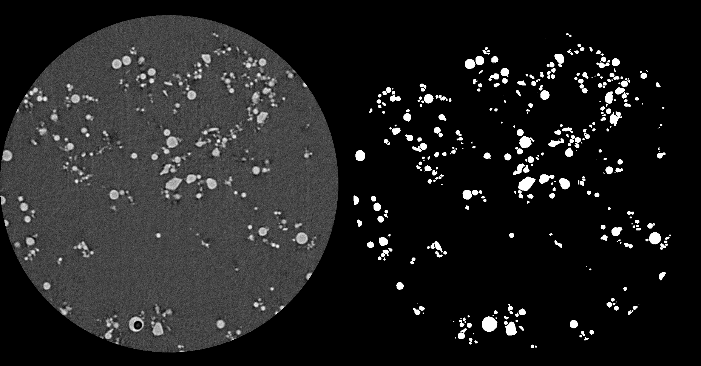

# Spherical mineral segmentation on CT scan images
In this project, it is desired to analyze the properties of minerals such as sphericity, volume and 2D projection area of each single mineral. After a quick qualitative analysis of the CT scan data, it can be seen that the minerals have mainly spherical shape. In this manner, the data can be segmented by using marker-based watershed segmentation algorithm.

You can see the input and the output of the project in the folder "data".

Within the project, I used the image processing software ImageJ, its plugins and MATLAB. 

Here is the download link for ImageJ: [Download ImageJ](https://imagej.net/Downloads)

Here is the plugin webpage: [ImageJ 3D segmentation plugin](https://imagejdocu.tudor.lu/plugin/segmentation/3d_spots_segmentation/start#d_segmentation)

# Challenges
1. Holes in the minerals
One of the problems is the minerals including a hole in their body, i.e. life buoy shaped mineral. It is asked for that these holes should be filled for the analyze, see the figure below. In order to do that, I followed the procedure: I used the sphericity of these holes in the following manner: I applied the watershed segmentation on the background and filtered out the particles having sphericity lower than a threshold.

2. Oversegmentation
Another encountered common problem during the watershed algorithm is oversegmentation. In order to fix that, the markers of the watershed algorithm should be carefully chosen. I used the plugin's tool Maxima Finder to find the markers. After a few tentative attemps, I set optimal XY radius and threshold.

# Procedure
I applied two watershed segmentation algorithms consecutively: First, holes in the minerals are filled up by using the sphericity of holes, i.e. hole segmentation, followed by the mineral segmentation. Here is the procedure I followed to segment minerals in the CT scan data:

1. Hole segmentation (*Enhance contrast after the step)
- Threshold where background larger*
- Distance transform*
- Mean filtering*
- Maxima finder on the filtered image*
- Watershed (mean filtered + maxima) and binarize
- Detect and fill the holes, where sphericity > 0.85

2. Mineral Segmentation (*Enhance contrast after the step)
- Distance transform on the image where minerals are larger*
- Mean filtering*
- Maxima finder on the filtered image
- Watershed (mean filtered + maxima) and binarize

