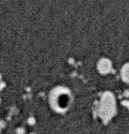
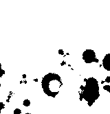
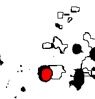
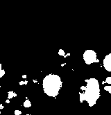
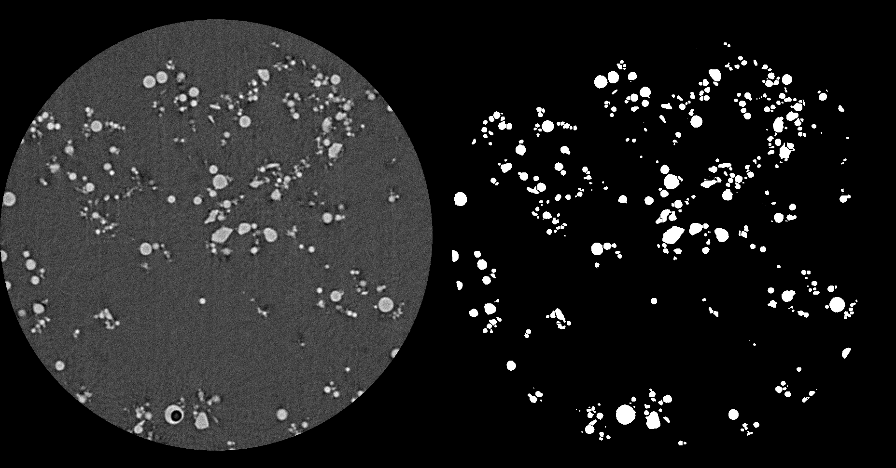

# Spherical particle segmentation on CT scan images

## Introduction
In this project, I want to analyze the properties of particles (sphericity, volume and 2D projected area) in 3D CT scan data, see Figure below for a slice from the dataset. Here, I will describe the segmentation of the particles in the dataset.

## Dataset
You can find an example input and my method's output (50 slices each) in the folder `data`.

## Installation
Within the project, I used the software ImageJ, its plugins and MATLAB. 

Here is the download link for ImageJ: [Download ImageJ](https://imagej.net/Downloads)

Here is the plugin's webpage: [ImageJ 3D segmentation plugin](https://imagejdocu.tudor.lu/plugin/segmentation/3d_spots_segmentation/start#d_segmentation)

## Problems & Approaches

As I mentioned, I want to segment particles in the dataset. However, I have a problem for the final segmentation: holes in particular particles, see Figure below. These holes give trouble for a full segmentation of particles. So, I have to fill these holes. The idea in my mind is to extract these holes by using their [sphericity factors](https://en.wikipedia.org/wiki/Sphericity). So, first, I separated these holes from the background by using the watershed algorithm. Then, I filtered out all the components which have a lower sphericity factor than a threshold, see Figure below. That simple!

After filling these holes, I am ready for the final segmentation. I used the watershed algorithm again but on the particles this time. Here is what I got.

## Procedure
I applied two watershed segmentation algorithms consecutively: First, holes in the particles are filled up by using the sphericity of holes (see the details at **Challenges**), i.e. hole segmentation, followed by the particle segmentation. Here is the procedure I followed to segment particles in the CT scan data:

1. Hole segmentation (*Enhance contrast after the step)
- Inverse image : Binarizing the CT scan image such that the voxel values of background larger*
- Grayscale image : Applying distance transform on the inverse image * followed by Mean filtering*
- Markers : Maxima finder on the grayscale image *
- Watershed image : Watershed (graycale  +markers ) and binarize
- Holes filled image : Detect and fill the holes in the watershed image  by extracting the components of large sphericity factor ( 0.85" title="sphericity threshold" />

2. Particle Segmentation (*Enhance contrast after the step)
- Grayscale image : Distance transform on the inverse holes filled image * + followed by Mean filtering*
- Markers : Maxima finder on the grayscale image 
- Watershed (graycale  +markers ) and binarize

## Notes
A common problem during the watershed algorithm is oversegmentation. In order to avoid that, you should pay attention to how to choose the markers of the watershed algorithm. I used the tool Maxima Finder in the [plugin](https://imagejdocu.tudor.lu/plugin/segmentation/3d_spots_segmentation) for that. After a few tentative attemps, I set optimal kernel radius and threshold.
